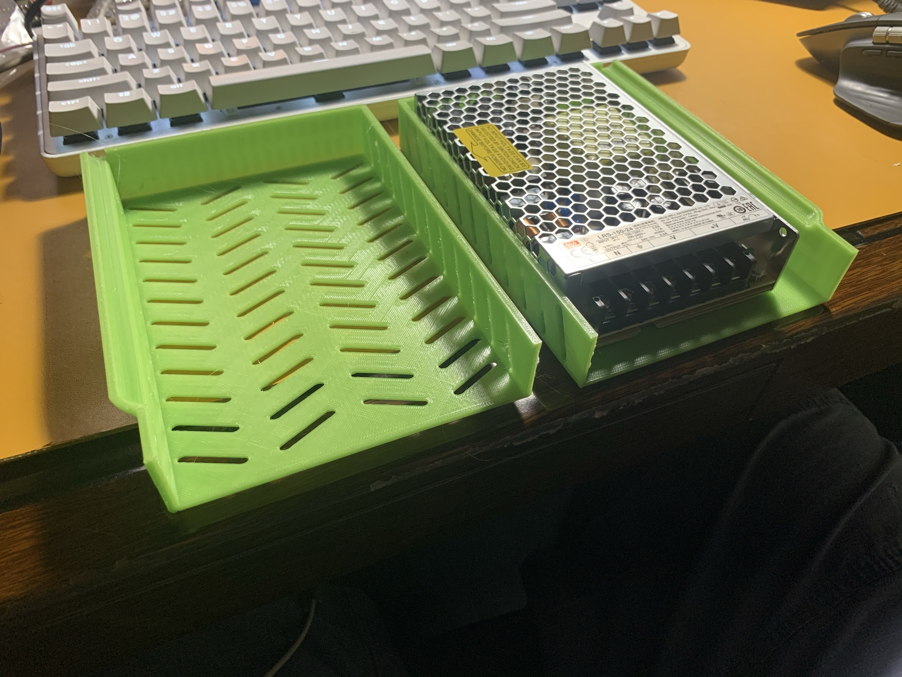
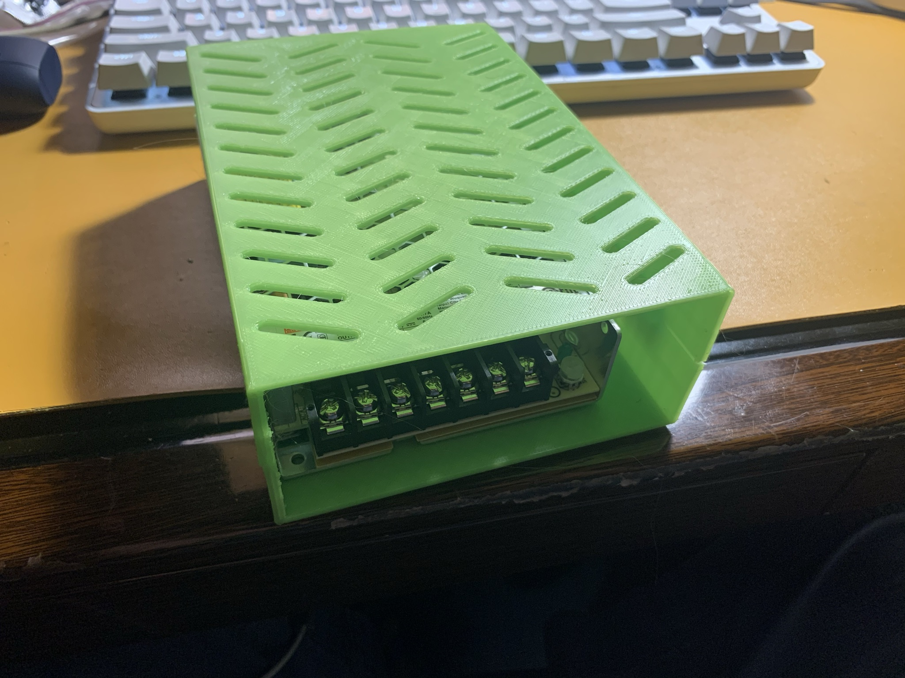
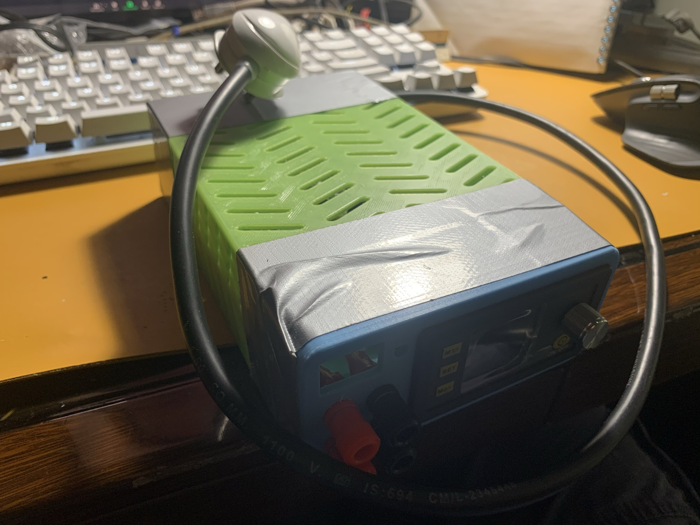
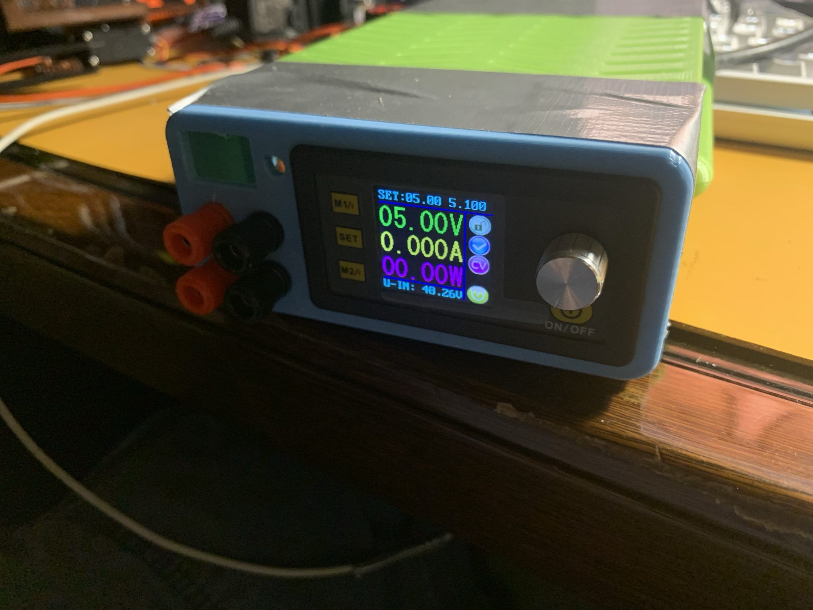

Author: [@anujdeshpande](https://github.com/anujdeshpande)

I built a small desktop power supply, which has profiles, and can output constant-current, or constant-voltage - from 0 to 48V.

This means that I can use it to charge batteries as well! I am using the same DC-DC converter from this Dave Jones video

## Hardware

1. [Drok 0-55V DC-DC converter](https://www.droking.com/250W-Digital-Controller-Buck-Adjustable-Voltage-Regulator-DC-6-55V-to-0-50V-5A-Power-Supply-Module-Adapter-Digital-Meter)
2. [Mean Well LRS-100-48 48V 2.3A](https://www.amazon.in/gp/product/B06WLQX6YX/)
3. 3-pin plug and wires
4. 4mm banana plug connectors
5. [3D printed enclosure](https://www.printables.com/model/38750-lab-power-supply-cheap-powerful/files): I tweaked a bunch of things here, most importantly the length of the box that houses the Mean Well PSU.

## Notes
- [User manual for the DC-DC converter](https://web.archive.org/web/20230203065849/https://images-na.ssl-images-amazon.com/images/I/B1beMgNFeBS.pdf)
- Edit - beriberikix on Twitter pointed out that I can run open source firmware on the Drok module! [github.com/kanflo/opendps](https://web.archive.org/web/20230203065849/http://github.com/kanflo/opendps)

## Images

