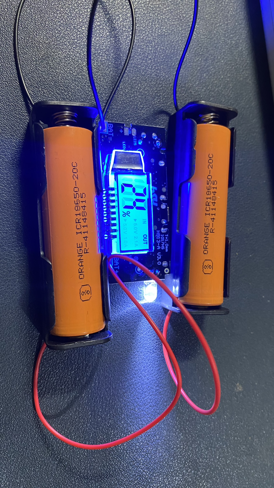
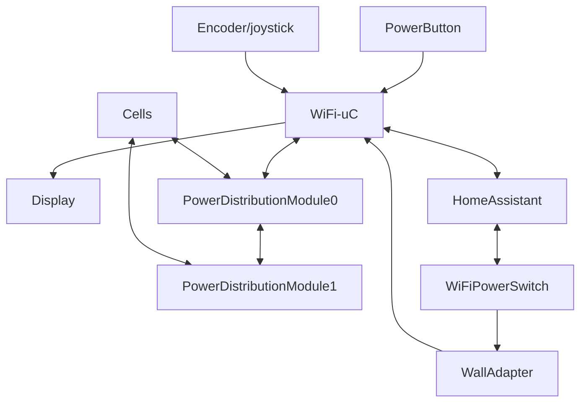

Despite the heavy name, the project aims to build a configurable, customizable battery project - including whatever firwmare is needed.

## Objectives

1. User configurable capacity (i.e. number and configuration of cells)
2. USB C PD standard for maximum compatibility
3. Start with USB C charging - add AC mains
4. Open source firmware - display, API for HomeAssistant
5. Current measurement on all ports
6. Made using open standards and tools (KiCad, Zephyr, FreeCAD)
7. Variants
   - Power bank
   - UPS
   - Field battery for timelapse cameras
8. API for HomeAssistant/Cloud control/AMC

## Applications

1. Power source for remotely deployed projects (manage battery information remotely)
2. Log data of your devices charging profile over time - create a db of such profiles (for example iPhone 11 with battery capacity 85% is best charged with this profile)
3. Kitchen appliances with USB C and battery are a thing
4.

## Builds

### Mark 1

- Off the shelf parts
- Components
  - 1x [Mobile Power Boost DIY 18650 Lithium Battery Digital Dual USB](https://robu.in/product/mobile-power-boost-diy-18650-lithium-battery-digital-dual-usb/)
  - 2x [Orange ICR 18650 2000mAh (3c) Lithium-Ion Battery](https://robu.in/product/orange-icr-18650-2000mah-20c-lithium-ion-battery/)
  - 2x [Black Plastic Storage Box Case Holder For Battery 1 x 18650 Cell](https://robu.in/product/1-x-18650-cell-box/)
- Photos

- The above build works as expected. @anujdeshpande used it to charge his phone a couple of times. As advertised the current doesn't go above a 1A using the power boost PCB.

### Mark 2

## Links

1. [Beckn protocol](https://github.com/beckn/Unified-Energy-Interface). Beckn is a general purpose protocol which applies well to the energy sector (charging networks and vehicles).
